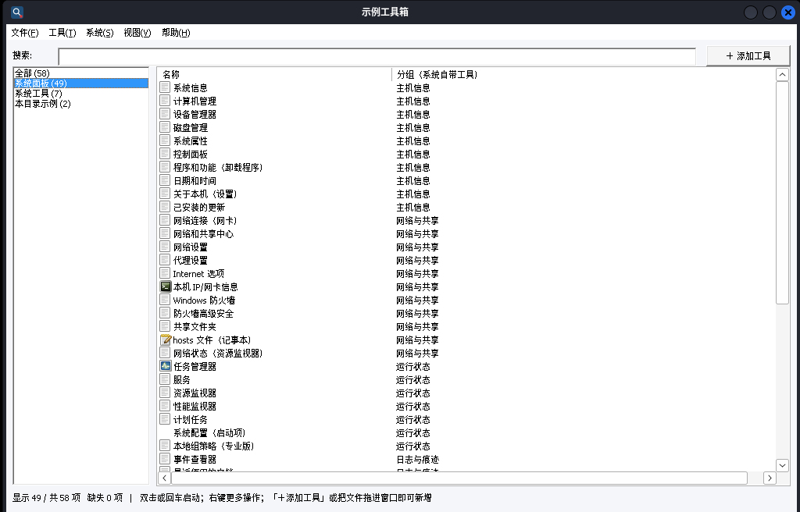

# 便携快速启动器（Windows）

一个**免安装、绿色、零依赖**的 Windows 工具启动器：把一堆散的 exe / bat / ps1 / 文档按面板分类列出来，
搜索即启动；**界面里就能加工具、改名字、删条目**，不用手改配置文件。
单文件 exe，不需要 .NET / Java / Python，不改注册表，Windows 7 / 10 / 11 通吃（32 位版兼容性最好）。

最初是为了替代 Rolan 这类启动器而写：**路径全部相对启动器自身目录**，整个工具箱连同启动器一起拷到
U 盘、换电脑、换盘符都不会失效。

```
便携快速启动器.exe   ← 放在工具箱根目录（和你的工具放一起）
tools_utf8.txt       ← 同目录，一行一个工具（也可以完全不用它，直接用界面添加）
```

## 一、特性

| 能力 | 说明 |
|---|---|
| 面板分类 | 左侧面板按工具的面板名自动聚合，带条目计数 |
| 实时搜索 | 顶部输入框，匹配名称 / 相对路径 / 面板名，忽略大小写，回车启动第一条 |
| **界面增删改** | 右上角「＋ 添加工具」，或工具菜单 / 右键菜单 / `Ctrl+N`；选中条目可**编辑、删除**（`Del`） |
| **拖放添加** | 把一个或多个 exe / bat / ps1 直接拖进窗口即可加入当前面板 |
| **新建分类** | 添加工具时面板框里直接输入新名字 = 新建一个面板 |
| **导入 / 导出 / 新建** | 文件菜单里：新建空配置（清空）、**导入配置**（本格式 txt，或**直接导入 Rolan 的 `Rolan.cfg` / `.rcb`**，自动识别解密）、**从文件夹批量新建**（扫一个目录按文件夹名建面板，可含子目录）、**导出配置**（另存 UTF-8 txt，可只导出当前搜索结果/当前面板） |
| **自动写回配置** | 界面里的增删改直接写回 `tools_utf8.txt`（UTF-8 + CRLF，保留原有注释行）；首次写回前自动备份 `tools_utf8.txt.bak` |
| 图标 | 每个条目都显示真实 shell 图标（文件夹 / 压缩包 / bat / exe 各不相同）；exe、lnk 按整个文件取图标，不同工具不串图 |
| 文件缺失提示 | 文件不存在的条目**红色显示 + `[文件缺失]`**，一眼看出缺什么 |
| 右键菜单 | 启动 / 以管理员身份运行 / 打开所在文件夹 / 复制完整路径 / 编辑 / 删除 |
| 视图切换 | `Ctrl+1` 列表视图、`Ctrl+2` 大图标网格；配置里 `#VIEW=icon` 可设默认视图 |
| 脚本适配 | `.ps1` 自动用 `powershell -ExecutionPolicy Bypass -File` 启动；`.bat` 工作目录设为工具所在目录 |
| 启动速度 | **窗口和列表先出来**（约 4 ms 构建完 254 条），配置解析、文件检查、图标提取全排在窗口出现之后分块做 |
| **图标磁盘缓存** | 图标提取一次后写 `icon_cache.dat`（在 exe 同目录），**下次启动直接读缓存**：254 条约 2.5 s → 0.28 s；缓存不命中才回退到 shell 提取 |
| **内置「系统面板」** | 程序自带一批 Windows 系统管理常用入口（系统信息、网络连接、防火墙、事件查看器、截图工具…共 49 项），左侧面板固定显示、「系统」菜单按分组一键打开；**不写进配置文件、删不掉**，`#SYSPANEL=0` 可整个隐藏 |
| 无窗口自检 | `--selftest` / `--dump` / `--bench` / `--icons` / `--syspanel` / `--run` 开关，无图形环境（Wine / CI）也能验证 |

## 二、配置格式

`tools_utf8.txt`（UTF-8 编码），首行可写标题，其余每行一个工具：

```
#TITLE=示例工具箱
# 格式: 面板|名称|相对路径|参数
系统工具|记事本|C:\Windows\System32\notepad.exe|
我的脚本|一键采集|一键采集脚本\collect.bat|
我的脚本|巡检(管理员)|巡检\check.ps1|-ExecutionPolicy Bypass -File 巡检\check.ps1
```

- 路径**相对 exe 自身所在目录**；写成 `C:\...` 的绝对路径也支持。
- 参数可留空；`#` 开头的行与空行忽略。
- 找不到 `tools_utf8.txt` 时自动回退读同目录的 `tools_gbk.txt`（按系统 ANSI 代码页，中文 Windows 即 GBK）。
- 界面上改了工具，按 **F5** 重新载入就能看到外部手改的结果。
- 首行（或任意一行）写 `#NOCACHE=1` 可以关掉图标缓存（默认开）；缓存文件是 `icon_cache.dat`，删掉它下次启动会重新生成。
- 写 `#SYSPANEL=0` 可以隐藏内置的「系统面板」（见下一节）；界面上删不掉内置项，隐藏只能改配置。
- 示例见 [`config/tools_utf8.example.txt`](config/tools_utf8.example.txt)。

> 从 Rolan 迁移：**不用写脚本了**——文件菜单「导入配置…」直接选 `Rolan.cfg` / `.rcb` 就能导进来（自动识别、
> 自动解密、`%rp%` 自动转相对路径）。算法说明见 [`docs/rolan-cfg-解析报告.md`](docs/rolan-cfg-解析报告.md)。
>
> 换机器/分享给同事：在当前机器上「导出配置…」，对方机器上「导入配置…」即可（也可先搜索/选面板，只导出这一部分）。

## 三、内置「系统面板」

程序自带一个**只读的内置面板**，把 Windows 自带的系统管理入口按分组收在一起，不用自己往配置里加：

- **主机信息**：系统信息（msinfo32）、计算机管理、设备管理器、磁盘管理、系统属性、控制面板、程序和功能、日期和时间、关于本机（设置）、已安装的更新
- **网络与共享**：网络连接（ncpa.cpl）、网络和共享中心、网络设置、代理设置、Internet 选项、**本机 IP/网卡信息**（`cmd /k ipconfig /all`）、Windows 防火墙、防火墙高级安全（wf.msc）、共享文件夹、hosts 文件、网络状态（资源监视器）
- **运行状态**：任务管理器、服务、资源监视器、性能监视器、计划任务、系统配置（启动项）、本地组策略
- **日志与痕迹**：**事件查看器**、最近使用的文档、下载文件夹、回收站、本地用户和组、用户账户设置、注册表编辑器、证书管理器、系统还原、Windows 安全中心、设备与打印机
- **外设与截图**：**截图工具**、新建截图（Snip & Sketch）、屏幕键盘、放大镜、画图、计算器、记事本
- **常用命令**：命令提示符、PowerShell、磁盘清理

共 49 项。用法：

- 左侧面板里「系统面板」固定排在「全部」下面；也可以从顶部**「系统」菜单**按分组直接点，或按 `Ctrl+3` 跳过去。
- 这些都是**内置项**：不写进 `tools_utf8.txt`、不能编辑/删除（点了会提示），导出配置时也不含它们。
- 目标既可以是系统命令（`wf.msc`、`control.exe`），也可以是协议（`ms-settings:network`、`ms-settings:network-proxy`）和 `shell:` 路径（`shell:recent`）；`ms-settings:` 这类“设置”入口需要 Win10 及以上，打不开时会给出提示。
- 列表第二列显示的是**分组**（普通面板显示的是路径）；`--syspanel 报告.txt` 可以把这份清单和每条会执行的命令导出核对。
- 想加自己的常用项（科室系统、某个脚本），照旧用「＋ 添加工具」。



## 四、三种用法

| 方式 | 文件 | 适用 |
|---|---|---|
| **原生 exe（推荐）** | `dist/便携快速启动器.exe`（32 位）/ `dist/便携快速启动器_x64.exe` | 双击即用，功能最全，有图标，能界面增删改 |
| HTA 网页版 | `hta/便携快速启动器.hta` + `hta/tools.js` | 系统自带 mshta 直接跑，exe 被杀软拦时的备用方案（**只读**，增删改请在 exe 版里做；同样带内置「系统面板」49 项） |
| 批处理菜单 | `hta/启动菜单.bat` | 兜底：控制台里敲数字选工具（GBK + `chcp 936`） |

把 `dist/` 里的 exe、`config/tools_utf8.example.txt`（改名成 `tools_utf8.txt`，或换成你自己的配置）
拷到工具箱根目录即可。HTA 版还需要 `hta/tools.js` 和 `.hta` 放在同一目录。

## 五、快捷键

| 快捷键 | 作用 |
|---|---|
| `Enter` | 启动选中条目（没选中时启动当前列表第一条；搜索框里则是匹配到的第一条） |
| `Ctrl+N` | 添加工具 |
| `Del` | 删除选中条目 |
| `Ctrl+1` / `Ctrl+2` | 列表视图 / 大图标视图 |
| `Ctrl+3` | 跳到内置「系统面板」 |
| `F5` | 重新载入配置 |
| `Esc` | 清空搜索框 |
| 双击 | 启动；**点在列表空白处不会启动任何东西**（v1.1 修复） |

## 六、命令行开关（排查 / 自动化用）

```bat
便携快速启动器.exe --selftest 报告.txt [关键字]  :: 不开窗口，把条目数/面板统计/缺失文件写进 UTF-8 报告
便携快速启动器.exe --dump 清单.txt               :: 不开窗口，导出解析后的全部条目（面板|名称|路径|参数）
便携快速启动器.exe --additem "面板|名称|路径|参数" [报告]  :: 走与界面相同的添加+保存逻辑（不会弹窗）
便携快速启动器.exe --run 3                      :: 不开窗口，按界面同样的逻辑启动第 4 条（0 开始编号）
便携快速启动器.exe --bench 基准.txt              :: 输出配置读取 / 搜索 / 图标提取耗时（含文件检查分段）
便携快速启动器.exe --icons 报告.txt             :: 只跑图标阶段，报告缓存命中数/提取数/耗时（连跑两次即可看冷/热差别）
便携快速启动器.exe --import 文件 [报告] [replace]  :: 导入配置（自动识别启动器 txt / Rolan cfg），replace = 先清空
便携快速启动器.exe --export 文件 [报告]           :: 导出当前配置为 UTF-8 txt
便携快速启动器.exe --scan 目录 [报告] [r]         :: 扫描目录建面板（r = 含子目录）
便携快速启动器.exe --newcfg [报告]                :: 清空配置（新建空配置）
便携快速启动器.exe --syspanel 清单.txt            :: 列出内置「系统面板」49 条：分组/名称/启动命令/图标文件是否存在
```

无图形环境（Wine、CI）下这几个开关是唯一可靠的验证手段——本项目所有 GUI 行为都是靠它们 + 无头 X 下真点击截图验证的。

## 七、从源码构建（Linux 交叉编译）

```bash
sudo apt install gcc-mingw-w64-x86-64 gcc-mingw-w64-i686
bash src/build.sh        # 产物输出到 dist/
```

- `src/便携快速启动器.c`：主程序，Win32 API + comctl32，Unicode，零第三方依赖
- `src/app.rc` / `src/app.manifest`：图标、版本信息、清单（DPI 感知 + asInvoker）
- `src/make_icon.py`：用 PIL 生成 `app.ico`
- 32 位版优先（Win7/10/11 通吃）；资源要用 `windres -c 65001` 编译，否则中文版本信息乱码

## 八、验证记录

在 Wine 10.0 + 无头 X（Xvfb + xfwm4）下实测，GUI 部分用 xdotool 真实点击、截图判读，启动结果用「目标脚本落地写文件」当探针：

| 验证项 | v1.1 结果 |
|---|---|
| 读 UTF-8 配置 / 中文标题 | ✅ `--selftest` 标题、条目数、面板统计正确 |
| 相对路径拼接 / 缺失识别 | ✅ 路径拼到 exe 所在目录；缺失条目红色 `[文件缺失]`，补齐后计数归零 |
| **空白处双击** | ✅ **0 个工具被启动**（v1.0 会误启动第一条，已用旧版 exe 对照复现） |
| 条目上双击 / 回车 | ✅ 目标 .bat 被启动并写出标记文件 |
| 界面**添加**工具 | ✅ 选文件 → 填名称/面板/参数 → 确定；配置尾部新增该行，列表自动选中新条目 |
| 界面**编辑**条目 | ✅ 改名后写回配置（`标记工具C` → `标记工具C2`） |
| 界面**删除**条目 | ✅ `Del` + 确认后条目消失，磁盘文件保留 |
| 首次写回备份 | ✅ 生成 `tools_utf8.txt.bak`（227 字节，写回前的内容） |
| 重复条目 | ✅ `--additem` 相同面板+路径第二次被跳过 |
| 32 位 / 64 位两个 exe | ✅ 都能 `--selftest` / `--dump` |
| 图标异步填充 | ✅ 首屏立即显示，图标随后补齐，不卡界面 |
| **启动顺序**（v1.2） | ✅ 窗口出现后 1 s 截图：254 条列表已完整显示，状态栏显示"正在后台检查文件是否存在…（72 / 254）"，界面可交互 |
| **文件检查不卡首屏**（v1.2） | ✅ 检查与图标分小步做，每步结束强制重绘；254 条全量检查仅 2.1 ms（但不再挡在窗口前面） |
| **图标缓存**（v1.2） | ✅ 冷启动 254 条：提取 152 个图标 2480 ms、写缓存 776 KB；热启动：**命中 252/254，提取 10 ms，图标阶段 236 ms，整体 2510 ms → 277 ms** |
| 缓存内容与实时提取一致 | ✅ 缓存由 ImageList 里的图标副本生成，二次启动截图里的图标与首次完全一致 |
| **导入配置（v1.3）** | ✅ 合并导入 +3 条；重复导入 0 新增 / 3 跳过；替换导入后采用导入文件的 `#TITLE` |
| **导入 Rolan cfg（v1.3）** | ✅ 合成 `Rolan.cfg` 导入 4 条：面板名、名称、`%rp%` 相对路径、启动参数都对；外部绝对路径原样保留 |
| **导出 / 往返（v1.3）** | ✅ 导出 UTF-8 txt（3 条）→ 清空 → 再导入：条目与导出前完全一致 |
| **从文件夹批量新建（v1.3）** | ✅ 扫描目录：一层 3 个（跳过 .txt）、含子目录 +1；面板名取文件夹名，相对路径正确 |
| **内置「系统面板」清单（v1.4）** | ✅ `--syspanel` 49 条全部解析成 `C:\Windows\System32\...`，分组/名称/启动命令/参数正确；`--selftest` 面板统计 `系统面板=49` 且排在「全部」之后 |
| **内置项不写回配置（v1.4）** | ✅ 走界面保存逻辑（`--additem`）后，配置文件里 `系统面板` 出现 **0 次**；导出配置同样不含内置项 |
| **启动内置项（v1.4）** | ✅ `--run 56`（记事本）→ `notepad.exe` 进程起来；`--run 26`（本机 IP）→ `cmd.exe /k ipconfig /all` 起来；无头 X 下双击「注册表编辑器」→ `regedit.exe` 起来 |
| **「系统」菜单（v1.4）** | ✅ `Alt+S` 展开：6 个分组子菜单（主机信息/网络与共享/运行状态/日志与痕迹/外设与截图/常用命令）+「打开系统面板」，截图确认 |
| **`#SYSPANEL=0`（v1.4）** | ✅ 加上该行后左侧不再出现「系统面板」；保存配置时该行会原样保留（不会被写丢） |
| **HTA 版同一份面板（v1.4）** | ✅ `node --check` 语法通过；无头 Chrome 渲染：侧栏 `全部 56 / 系统面板 49 / 系统工具 6 / 本目录示例 1`，点入 49 行（第二列显示分组），搜索 `regedit` → 命中 1 行 |

## 九、已知的坑（都踩过）

- **manifest 里不要写 `Microsoft.Windows.Common-Controls 6.0.0.0` 依赖**：Wine 下直接 `c0000135 (DLL 未找到)` 起不来。只留 dpiAware + asInvoker 最稳（代价是经典控件外观）。
- 配置为 CRLF 时字段尾部会带 `\r`，解析要 trim，回写注释行时也要 trim，否则每次保存多一个 `^M`。
- 自绘对话框（不依赖资源）：**控件文本要在窗口 `ShowWindow` 之后 `SetWindowText`**，在 `WM_CREATE` 里填在部分环境不重绘，显示成空白框。
- 双击处理必须用 `NMITEMACTIVATE.iItem` 判断落点，否则点在空白处会退化成"启动第一条"。
- Wine 下用 `xdotool` 注入按键偶尔不生效、`MessageBox` 收不到鼠标点击（键盘可用）；验证启动改用双击或 `--run`。
- 用 `xdotool type` 输入中文路径要先 `LC_ALL=zh_CN.UTF-8`，否则报 `Invalid multi-byte sequence`。
- 交接 `.bat` 必须 GBK + CRLF；exe / ico / png 要在 `.gitattributes` 里声明 binary。
- `GetOpenFileNameW` 的 `lpstrFilter` 里**双 NUL 分隔必须写单反斜杠 `\0`**：源码里误写成 `\\0` 时对话框会把整个过滤器当一长串显示出来（`配置文件 (*.txt;*.cfg;*.rcb)\0*.txt...`），编译器不报错，只有跑起来才看得见。
- `SHBrowseForFolderW` 用 `BIF_NEWDIALOGSTYLE` 时要先 `CoInitializeEx`；调用失败（被组策略禁用等）要有退路——本项目退路是"进入该文件夹、点里面任意一个文件，用它的父目录"。
- 解析 Rolan cfg：`[Data]` 之后要**跳过 `[Data]` 这一行本身**再按行读，否则第一行以 `[` 开头会被当成段结束直接 break（表现为"识别成 Rolan 配置但导入 0 条"）；条目明文里取字段用 `Title:` / `,Path:`（前导逗号避免匹到 `IcoPath:`）。
- 图标缓存的两个坑：① **不要对 shell 给的通用图标（`SHGFI_USEFILEATTRIBUTES`）取像素**——个别环境（Wine）`GetDIBits` 会挂死，而且这类图标按扩展名重取很便宜；② 像素要从 **ImageList 里的副本**（`ImageList_GetIcon`）取，不要在 `ImageList_AddIcon` 之前动 shell 返回的 HICON，否则会把图标搞坏（列表全变占位图标）。
- 老式图标没有 alpha 通道：取像素时要用 AND 掩码补 alpha（掩码位=1 → 透明），否则重建出来的图标背景发黑。
- 后台分块做事（检查文件 / 提图标）时**每步都要 `UpdateWindow`**：连续 PostMessage 会让 WM_PAINT 排队在后面，窗口出现但列表一片空白。
- 内置系统面板这类“快捷入口”**不能进 `write_items`**：一旦被写进配置文件，下次启动就变成删不掉的重复普通条目。给条目加个 `bi` 标记，保存/导出时跳过。
- 内置项的目标要交给 shell 解析（裸命令名 `wf.msc` / `control.exe`、协议 `ms-settings:network`、`shell:recent`），**不要硬编码 `C:\Windows\System32`**：32 位进程在 64 位系统上访问 `System32` 会被重定向到 `SysWOW64`，Wine 下同样如此（往 `system32` 补文件没用，得补到 `syswow64`）。
- URI 类内置项（`ms-settings:`、`shell:`）没有对应文件，所以「文件缺失」检查得挂一个**等价图标来源文件**（`control.exe`、`shell32.dll` 之类），别拿启动目标本身去查，否则永远标红。

## 十、许可

MIT，见 [LICENSE](LICENSE)。
